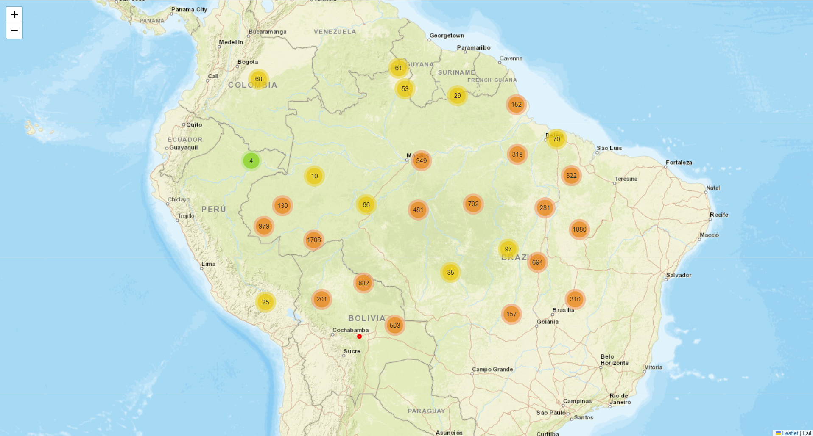

# 🌍 NASA Near-Real-Time Wildfire Tracker

An interactive data visualization project built with Python that fetches near-real-time thermal anomaly data from the [NASA FIRMS API](https://firms.modaps.eosdis.nasa.gov/) and maps active wildfires.



## 🔍 Project Overview
This script connects to the VIIRS sensor on the NOAA-20 satellite to pull raw wildfire data. By default, the coordinates are set over central South America, which currently tracks approximately **10,000 active fire hotspots** over a 3-day period. The data is parsed using Pandas and visualized on an interactive web map using Folium.

## ✨ Features
* **Live Satellite Data:** Directly queries the NASA API for the latest tabular CSV thermal data.
* **Fully Customizable:** You can easily change the `area` (bounding box coordinates) and `day_range` variables in the code to track fires in any region of the world.
* **Interactive Clustering:** Utilizes `Folium MarkerCluster` to smoothly render thousands of data points without lagging the browser.

## 🚀 How to Run Locally

1. **Get an API Key:** Register for a free API key at [NASA FIRMS](https://firms.modaps.eosdis.nasa.gov/api/).
2. **Setup the Code:** Clone this repository and insert your key into the `MAP_KEY` variable inside the script.
3. **Install Dependencies:** 
   ```bash
   pip install -r requirements.txt

## 📊 The Data Under the Hood

The script pulls the tabular CSV data directly from the API into a Pandas DataFrame. Expanding the `day_range` to 3 was necessary to account for satellite pass intervals, which successfully captured over 10,000 active fire hotspots. 

Here is what the raw data extraction looks like in the terminal:

```text
(10658, 14)
   latitude  longitude  bright_ti4  scan  track    acq_date  acq_time satellite instrument confidence version  bright_ti5   frp daynight
0 -1.47277 -47.27147      315.96  0.48   0.40  2026-09-10       423       N20      VIIRS          n  2.0NRT      293.88  1.42        N
1 -1.47207 -47.27579      309.48  0.48   0.40  2026-09-10       423       N20      VIIRS          n  2.0NRT      293.75  1.42        N
2 -1.09959 -48.05491      320.29  0.54   0.42  2026-09-10       423       N20      VIIRS          n  2.0NRT      292.52  1.84        N
3 -0.88546 -47.57029      303.61  0.51   0.41  2026-09-10       423       N20      VIIRS          n  2.0NRT      292.68  0.58        N
4  0.24835 -51.46183      313.25  0.63   0.54  2026-09-10       423       N20      VIIRS          n  2.0NRT      288.97  2.55        N
Map saved as wildfire_map.html
